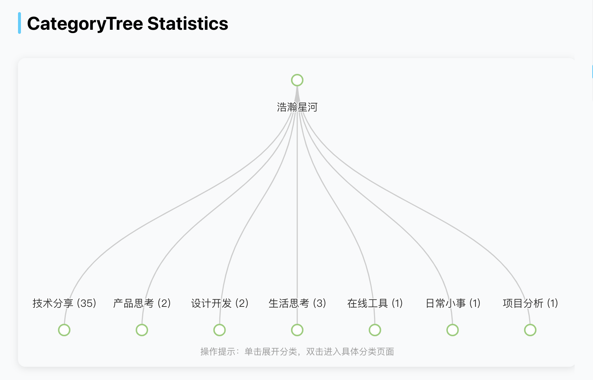

**push 或 pr 请按这个格式**

```bash
# merge将会自动发布 npm 包格式
feat: xxx
fix: xxx
```

并且修改 package.json 中的**版本号**

将自动发布 npm 包和同步包到淘宝镜像

> hexo-graph，一个基于 echarts，集成博客热力图，博客月份统计图，分类统计图，标签统计图的多元化可交互插件。

具体效果：https://haohanxinghe.com/social/stats/

代码仓库：

- [NPMJS](https://www.npmjs.com/package/hexo-graph?activeTab=readme)
- [GitHub](https://github.com/codepzj/hexo-graph)

## 安装依赖

```bash
pnpm i moment # 使用 hexo-graph 前先安装相关依赖
pnpm i hexo-graph
```

## 配置说明

在根目录的 `config.yml` 中配置主题：

### Dark 主题配置

```yaml
hexo_graph:
  theme: "dark" # light/dark，默认是 light
  echarts_js: "/vendor/js/echarts.min.js" # 可自定义地址，不填写默认为jsd的cdn
```

### Heatmap 年份切换

当鼠标悬停在 Heatmap 图标的左侧或右侧时，会显示向后或向前的箭头，点击箭头可以切换到上一年或下一年的数据。


## 使用方法

在**任意页面**中导入以下 HTML 标签：

```html
### Blog Heatmap
<div id="heatmapChart" style="width: 100%; height: 200px; overflow-x: auto; overflow-y: hidden;"></div>
```


```html
### Monthly Article Statistics
<div id="monthlyChart" style="width: 100%; height: 350px; overflow-x: auto; overflow-y: hidden;"></div>
```


```html
### Tag Statistics
<div id="tagsChart" style="width: 100%; height: 400px; overflow-x: auto; overflow-y: hidden;"></div>
```


```html
### Category Statistics
<div id="categoriesChart" style="width: 100%; height: 350px; overflow-x: auto; overflow-y: hidden;"></div>
```


```html
### CategoryTree Statistics
<div id="categoriesTreeChart" style="width: 100%; height: 400px; overflow-x: auto; overflow-y: hidden;"></div>
```



## 进阶配置

### Heatmap 年份配置

可以在 HTML 标签中添加 `year` 属性来指定年份，不填默认为当前年份。

```html
<div id="heatmapChart" year="2024" style="width: 100%; height: 200px; overflow-x: auto; overflow-y: hidden;"></div>
```

### 自定义配色

该插件支持自定义颜色。`monthlyColors` 只允许填一个主题颜色，其他颜色支持多个，不配置则采用默认配置。

```yaml
hexo_graph:
  theme: "light" # 或者 'dark'
  monthlyColors:
    - "#FF9A8B" # 粉红色与橙色的渐变
  heatmapColors:
    - "#A3DFF7" # 浅天蓝色
    - "#B5D8C4" # 浅绿松石色
    - "#F7C9B7" # 浅珊瑚色
  tagsColors:
    - "#F2A7D1" # 粉紫色
    - "#F5E05D" # 明亮的黄绿色
    - "#D74B76" # 玫瑰红色
    - "#1EAEAC" # 湖蓝色
    - "#FFC836" # 浅橙色
    - "#A8A2FF" # 薰衣草紫
    - "#A9E9FF" # 浅天蓝色
    - "#FF6767" # 鲜艳红色
  categoriesColors:
    - "#4C8C99" # 青蓝色
    - "#F9B5E2" # 浅桃粉色
```
